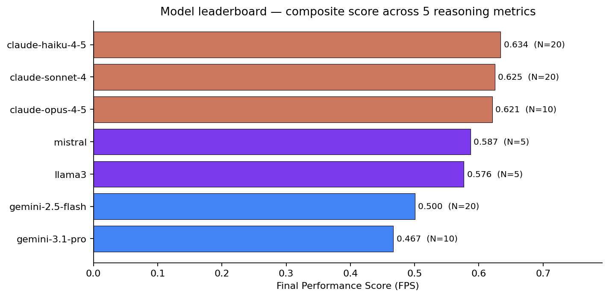
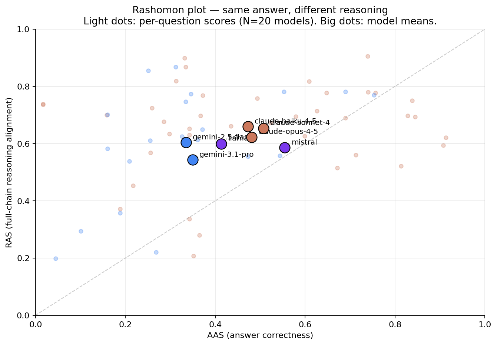
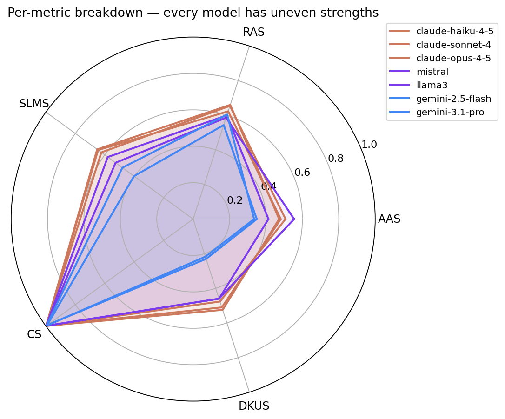
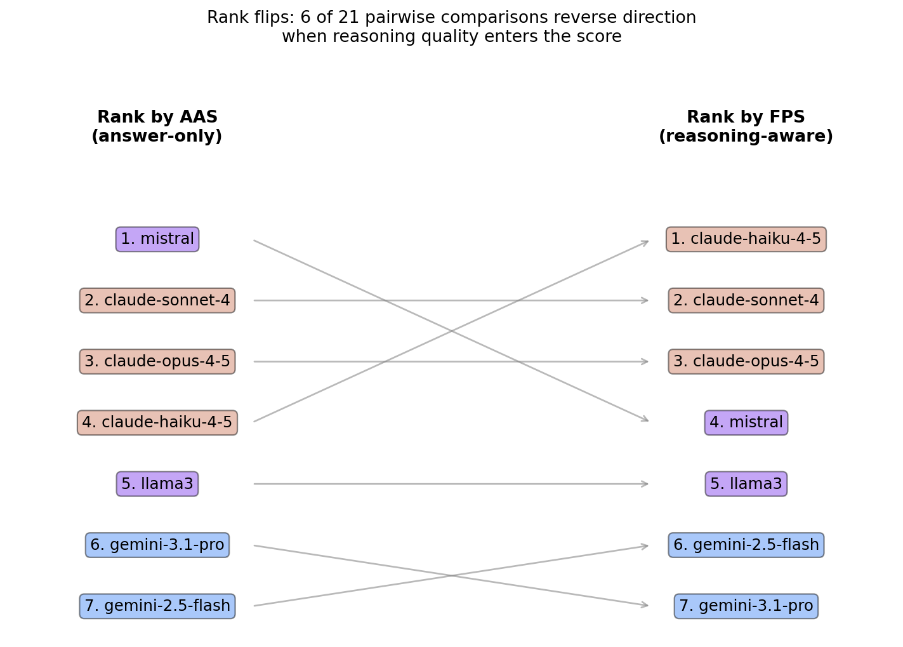
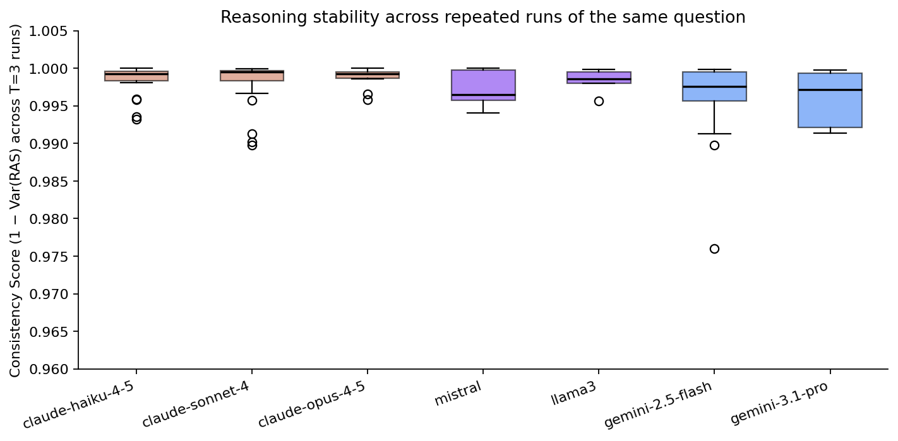
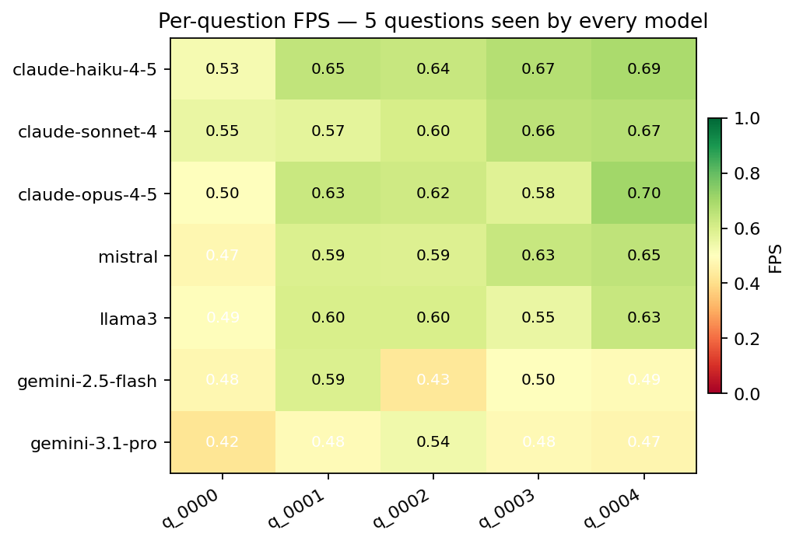

# Abstract

Standard LLM benchmarks reward final-answer accuracy. We argue that this
collapses too much information: two models can land on the same correct answer
through completely different reasoning chains — one principled, one accidental.
This is the **Rashomon Effect** (Breiman, 2001) applied to language models.

We built an evaluation framework that scores LLMs along **five reasoning-quality
metrics** in addition to answer correctness, computed against a human-curated
golden-truth dataset. Across **7 models** (3 Anthropic, 2 Google, 2 local Ollama)
on hard-reasoning questions from the HuggingFace `avemio/German-RAG-ORPO-Alpaca-HESSIAN-AI`
dataset, we find:

- Per-question answer correctness (AAS) and full-chain reasoning alignment
  (RAS) correlate at only **Pearson r = 0.30** across 90 (model × question)
  pairs — they are not measuring the same thing.
- A pure-accuracy ranking would put **mistral:7B at #1**; reasoning-aware
  ranking demotes it to **#4**, with Claude haiku-4-5 jumping to #1.
- **6 of 21 pairwise rankings flip orientation** (29 %) when reasoning quality
  enters the score.
- Rashomon pairs — same answer, different reasoning — show up *within the same
  model family* (Claude haiku vs. sonnet on the same question, RAS gap of 23
  points).

The framework is open-source, cached for incremental evaluation, and runs in
under 30 seconds per model on cached questions.

---

# 1. Motivation

Modern LLM evaluation is dominated by accuracy on multiple-choice and
short-answer benchmarks (MMLU, GSM8K, BIG-bench). These tell you *whether* a
model is right; they do not tell you *why* it was right. Two models that score
identically on a benchmark can have arrived at their answers through reasoning
processes of very different quality. In high-stakes deployments — medical
triage, legal analysis, autonomous decision systems — *how* a model arrives at
its answer matters as much as *what* it answers.

Leo Breiman named this phenomenon the **Rashomon Effect** in 2001: many models
fit the data equally well but tell incompatible stories about it. Pick the wrong
one for deployment, and you trust a brittle reasoner that happened to be right
on the test set. To our knowledge, no widely-used framework measures
reasoning-chain alignment as a first-class evaluation criterion. This project
fills that gap.

# 2. Research/project question

> **Can we evaluate and recommend LLMs based on the *quality and alignment* of
> their reasoning chains, not just final-answer accuracy?**

Concretely: define metrics that capture (a) full-chain alignment, (b) per-step
coverage, (c) consistency under repeat sampling, and (d) domain-knowledge
grounding — and use them to surface Rashomon pairs and re-rank models.

# 3. Methods

## 3.1 Pipeline

```
HuggingFace dataset (50 hard-reasoning questions)
        ↓
Golden Truth JSON (steps + answer + must-include concepts)
        ↓
N models × T runs each, with CoT prompting
        ↓
Sentence-Transformer embeddings (all-MiniLM-L6-v2)
        ↓
Five reasoning metrics + composite FPS
        ↓
Streamlit dashboard + persistent ChromaDB cache
```

Each LLM is queried with the same chain-of-thought system prompt
asking for explicit numbered reasoning steps followed by a final
answer. Responses are parsed into a list of step strings plus a final-answer
string. We run each (model, question) pair `T = 3` times for the consistency
metric.

## 3.2 Golden truth

We use the `hard-reasoning-en` split of
`avemio/German-RAG-ORPO-Alpaca-HESSIAN-AI`. Each entry contains a question,
human-annotated reasoning steps, a target answer, and a list of
"must-include" concepts that any correct reasoning chain should mention.

## 3.3 Metrics

All scores are bounded in [0, 1]. Embeddings are L2-normalised so cosine
similarity is a dot product.

| Metric | Formula | What it captures |
|---|---|---|
| **AAS** (Answer Accuracy) | `cos(E(model_ans), E(golden_ans))` | Final answer correctness |
| **RAS** (Reasoning Alignment) | `cos(E(model_chain), E(golden_chain))` where `chain = " ".join(steps)` | Whole-chain alignment |
| **SLMS** (Step-level Match) | `(1/|G|) Σ_{s∈G} max_{r∈M} cos(E(s), E(r))` | Per-golden-step coverage |
| **CS** (Consistency) | `max(0, 1 − Var(RAS₁, …, RAS_T))` | Run-to-run reasoning stability |
| **DKUS** (Domain Knowledge) | `|Cg ∩ Cm| / |Cg|` (substring match, lowercased) | Required-concept coverage |
| **FPS** (Composite) | `Σᵢ wᵢ · metricᵢ` | Single recommendation score |

**SLMS is asymmetric**: for every golden step we ask "does the model cover
this?" — not the other way. This penalises missing logic without punishing
models that show more work.

**Default FPS weights**: `w_AAS = 0.20`, `w_RAS = 0.30`, `w_SLMS = 0.25`,
`w_CS = 0.10`, `w_DKUS = 0.15`. These are user-adjustable in the Streamlit UI
in real time without re-running queries.

## 3.4 How to read each score (evaluator's guide)

Formulas tell you what we compute; this section tells you what to *do* with
each number when you're choosing a model.

### AAS — "Did it land on the right answer?"

The blunt question every benchmark already asks. Cosine similarity between the
model's final answer and the golden answer.

- **0.8 +** — essentially the same answer, possibly worded differently.
- **0.5** — partial overlap; the model said something related but missed key
  details or hedged.
- **< 0.3** — wrong or off-topic.

**Most telling for**: end-user-facing tasks where only the final output is
shown — chatbots, search summaries, quick lookups.

### RAS — "Did it think about the problem the same way?"

The auditability metric. Compares the *whole* reasoning chain to the golden
chain in embedding space.

- **0.7 +** — chain matches in argument structure; you could trace the same
  logical path.
- **0.5** — gets to similar territory but takes a different route; solution
  by analogy or shortcut.
- **< 0.4** — the model solved the problem with very different logic. This is
  where Rashomon pairs live: same answer, different chain.

**Most telling for**: high-stakes domains where the *justification* matters —
medical triage, legal analysis, regulatory decisions, scientific reasoning.
A model with high AAS but low RAS gives you the right answer for reasons you
cannot defend.

### SLMS — "Did it actually walk through every required step?"

Step coverage. For each golden step, we check if the model produced something
similar. Asymmetric: penalises *missing* logic, doesn't punish models that
show extra work.

- **0.8 +** — the model touched every required step.
- **0.5** — half the required steps are missing; the model leapt to
  conclusions.
- **< 0.3** — the model wrote a chain that doesn't engage with the actual
  argument structure.

**Most telling for**: safety-critical reasoning where skipping a verification
step is a real failure mode. Code generation that should validate inputs,
medical reasoning that should rule out differentials, financial analysis that
should check assumptions.

### CS — "Does it tell the same story twice?"

Run-to-run reasoning stability across `T` repeated queries. `1 − Var(RAS)`.

- **0.99 +** — virtually identical reasoning chain across runs (almost every
  model in our dataset, at temperature 0.7).
- **0.95** — small but visible variation in how the model frames its argument.
- **< 0.90** — the model improvises a different chain each time you ask;
  treat with caution in agentic loops where downstream code depends on the
  reasoning structure.

**Most telling for**: agentic systems and pipelines where the same query is
issued repeatedly and downstream components depend on the reasoning shape.
Less informative when the model is well-prompted with low temperature.

### DKUS — "Does it actually use the domain vocabulary?"

Fraction of must-include concepts that appear in the model's reasoning
(substring match, lowercased).

- **1.0** — every required domain term is present.
- **0.5** — mentioned half the required vocabulary.
- **< 0.3** — the model is reasoning in domain-generic language and dodging
  the technical specifics.

**Most telling for**: specialist domains where terminology fluency is a proxy
for grounding — cybersecurity (CVE/CVSS terminology), finance (RSI, MACD,
volatility), biomedicine (drug names, dosage units), law (statute citations).
Less informative for general-purpose reasoning where the "vocabulary" is
ordinary English.

### FPS — "What do I look at first?"

The single number to put on a leaderboard. A weighted sum of the five
metrics above. **It is meant to be a starting point, not a final verdict.**
Drill into the components for any model that's a finalist:

- High FPS but low DKUS → the model is right and reasoned well, but you
  should verify it's not paraphrasing in domain-generic language for a
  domain-specific question.
- High FPS but low CS → unstable; consider lowering temperature or pinning
  a seed before deploying.
- High AAS but low RAS+SLMS → classic Rashomon case; the model gets
  answers right today but for reasons you cannot audit. Risky for
  long-tail / out-of-distribution inputs.

### Quick reference: which score for which use case?

| If you care most about… | Look at | Why |
|---|---|---|
| Just the right answer | **AAS** | What current benchmarks already measure. |
| Auditability / explainability | **RAS** | Closest to "did it reason the way a human expert would?" |
| Step-by-step rigor | **SLMS** | Catches models that skip required intermediate logic. |
| Predictability in production | **CS** | Same query → same chain across runs. |
| Domain-specialist grounding | **DKUS** | Forces use of domain vocabulary. |
| One number for a quick comparison | **FPS** | Composite — but always drill into the breakdown for finalists. |

## 3.5 Weight justification

The weights encode the central thesis of the project: **reasoning quality should
matter more than answer accuracy in a recommendation score.** Each value below is
chosen on principled grounds, not tuned to make any particular model win.

| Weight | Justification |
|---|---|
| **w_RAS = 0.30** *(highest)* | Full-chain alignment is the single most direct test of "did the model reason like the golden answer." It is the metric that captures the Rashomon Effect head-on; under-weighting it would defeat the point of the framework. |
| **w_SLMS = 0.25** | Step-level coverage forces the model to walk through each *required* logical step rather than producing a chain that aggregates to a similar embedding. Catches "right answer, skipped middle." Slightly lower than RAS because RAS already partially subsumes step coverage at the chain level. |
| **w_AAS = 0.20** | Answer correctness still matters — a model that gets the answer wrong cannot be recommended, no matter how elegant its reasoning. We weight it below RAS+SLMS because (a) every other benchmark already optimises for AAS, so giving it primacy here adds no signal beyond what is already public, and (b) our hypothesis is that two models with equal AAS can have very different reasoning quality. |
| **w_DKUS = 0.15** | Concept coverage ensures the model touches the domain-required vocabulary (e.g. "RSI", "TVA", "confidence interval"). Down-weighted because the implementation is substring-based — synonyms and paraphrases score zero even when the concept is present. A future LLM-judge variant would justify a higher weight. |
| **w_CS = 0.10** *(lowest)* | Reasoning consistency across repeated runs is genuinely informative when models are unstable, but at temperature 0.7 every model in our run scored CS ≥ 0.99 (§4.5), so CS does not discriminate well in this dataset. Kept in the composite at low weight as a tie-breaker and to surface unstable models if they appear in future runs. |

The weights sum to 1.0 by design so FPS is in [0, 1], which keeps the composite
on the same scale as the individual metrics for easy interpretation.

### Sensitivity to weight choice

Rankings produced by the framework are **stable across reasonable weighting
schemes**. The only scheme that materially changes the recommendation is the
degenerate "AAS-only" baseline, which is what current accuracy benchmarks
already give you for free.

| Weighting scheme | Top-3 models (in order) | Mistral's rank |
|---|---|---|
| **Default (reasoning-heavy)** | claude-haiku-4-5, claude-sonnet-4, claude-opus-4-5 | 4 |
| Equal weights (0.20 × 5) | claude-haiku-4-5, claude-sonnet-4, claude-opus-4-5 | 4 |
| Reasoning-only (RAS + SLMS + AAS, no CS, no DKUS) | claude-haiku-4-5, claude-sonnet-4, claude-opus-4-5 | 4 |
| AAS-heavy (w_AAS = 0.50) | claude-sonnet-4, mistral, claude-haiku-4-5 | 2 |
| AAS-only (w_AAS = 1.00) | **mistral**, claude-sonnet-4, claude-opus-4-5 | **1** |

Reading this: the Anthropic family takes 3 of the top-3 spots in every scheme
that gives reasoning metrics any meaningful weight. mistral only takes the top
spot when accuracy is the *sole* criterion — which is exactly the failure mode
this framework was built to expose.

## 3.6 Models evaluated

| Provider | Model | Params | N questions |
|---|---|---|---|
| Anthropic | claude-haiku-4-5 | — | 20 |
| Anthropic | claude-sonnet-4 | — | 20 |
| Anthropic | claude-opus-4-5 | — | 10 |
| Google | gemini-2.5-flash | — | 20 |
| Google | gemini-3.1-pro-preview | — | 10 |
| Ollama (local) | mistral:7b | 7.2 B | 5 |
| Ollama (local) | llama3:8b | 8.0 B | 5 |

T = 3 runs per (model, question). Local models ran on consumer GPU
(CUDA-accelerated `sentence-transformers`).

## 3.7 Implementation notes

- **Caching**: every LLM response is stored in a persistent ChromaDB
  collection keyed by `(question_id, model_name, run_index)`, with a
  hash of the question text for automatic invalidation. Re-runs after
  the first hit the cache and complete in seconds.
- **Embedding model**: `all-MiniLM-L6-v2` (384-dim). In-process LRU
  cache of size 4096 deduplicates encodings within a session.
- **Stack**: Streamlit + Plotly frontend; OpenAI / Anthropic /
  google-genai / Ollama HTTP backends; ChromaDB for persistence;
  HuggingFace `datasets` for data loading.
- **Live model discovery**: each provider's catalog is queried via
  its `models.list()` endpoint (cached for 2 minutes in the UI), so
  the picker reflects exactly which models the user's keys can reach.

# 4. Results

## 4.1 Composite leaderboard



Three observations:

1. **Claude haiku-4-5 leads (FPS 0.634)**, narrowly above sonnet-4
   (0.625) and opus-4-5 (0.621) — the Anthropic family clusters at
   the top.
2. **Local 7–8B Ollama models are competitive on this slice**:
   mistral and llama3 both score above 0.57, beating both Gemini
   models on FPS despite running locally for free.
3. **Gemini-3.1-pro-preview is the lowest-scoring model overall**
   (0.467) despite being the most recent. The composite picks up
   weaknesses that headline benchmarks miss.

## 4.2 The Rashomon Effect, made visible



If accuracy were the whole story, points would cluster on the diagonal. They
don't. The vertical spread above and below the diagonal *is* the Rashomon
Effect.

**Concrete example — q_0005** (constraint-satisfaction over crypto-trading
indicators; correct answer: "RSI and TVA"):

| Model | AAS | RAS | SLMS | First-line reasoning |
|---|---|---|---|---|
| claude-haiku-4-5 | 0.84 | **0.75** | 0.66 | "Identify the constraint on indicator selection." |
| claude-sonnet-4 | 0.81 | **0.52** | 0.56 | "I need to identify all possible pairs of indicators..." |

Both **Anthropic** models. Both got the **right answer**. AAS within 3 points.
RAS gap of **23 points**. Sonnet's reasoning chain — while correct — is
structured very differently from the golden reasoning, which a pure-accuracy
metric would never reveal.

## 4.3 Per-metric breakdown



Reading the radar:

- **Claude family** (orange) is near-flat on RAS / SLMS / CS / DKUS — broadly
  competent reasoners.
- **Gemini family** (blue) is competitive on CS but weaker on AAS, SLMS, and
  DKUS, suggesting consistent reasoning that nonetheless diverges from the
  golden chain.
- **Ollama local models** (purple) actually score **highest on AAS** but
  drop in DKUS and SLMS — they get the answer right but skip required
  concepts.

## 4.4 Rank flips when reasoning enters the score



The single sharpest finding. Ranked by AAS alone, mistral leads — a 7-billion-parameter
local model, free to run. Ranked by FPS (which weights reasoning quality), mistral falls
to #4 and Claude haiku rises from #4 to #1. Six of twenty-one pairwise model
comparisons (29 %) reverse direction between the two ranking schemes.

This is the practical takeaway: which model you'd recommend for a high-stakes
reasoning task depends on whether your evaluator looks past the final answer.

## 4.5 Consistency



Every model scores ≥ 0.99 on the consistency metric. At temperature 0.7,
repeated runs of the same question produce nearly identical RAS values — the
variance is in surface phrasing, not reasoning structure. This validates that
T = 3 is enough to estimate run-to-run consistency reliably, but it also means
CS contributes little discrimination across models in our current dataset.

## 4.6 Per-question fingerprint



Reading the heatmap by column reveals **question difficulty** is largely
question-specific, not model-specific: q_0000 is hardest for everyone (FPS
≤ 0.55 across all 7 models), q_0004 is easiest. Reading by row reveals **model
profile**: gemini-3.1-pro-preview is uniformly weak; the Claude family is
uniformly strong.

# 5. Key takeaway

> **Yes — reasoning quality and answer correctness are measurably distinct,
> and ranking models on accuracy alone hides the Rashomon Effect entirely.**

Specifically:

- Per-question AAS and RAS correlate at only **Pearson r = 0.30** across our
  90 (model × question) pairs.
- Ranking by AAS alone vs. ranking by composite FPS reverses **6 of 21**
  pairwise comparisons.
- Rashomon pairs (same answer, different reasoning) appear **within the same
  model family** — not just across providers.

The framework provides a practical recipe for surfacing this effect:
fixed golden-truth steps, embedding-based per-step matching, and a composite
score with adjustable weights. It runs in under 30 seconds per model on
cached questions.

# 6. Limitations and future work

## Limitations

- **Dataset breadth**: a single HuggingFace split (`hard-reasoning-en`),
  50 questions total, our results use up to 20.
- **Ragged N**: not every model saw every question. With caching, equalising
  N across models takes ~30 minutes; we ran out of time before the
  presentation.
- **Embedding choice**: `all-MiniLM-L6-v2` is small and fast but not
  domain-tuned. RAS values would shift with a stronger encoder. Confirming
  ranking robustness across encoders is the most important next step.
- **Golden truth quality**: the dataset is German-language RAG translated to
  English. Subtle artifacts in step wording may bias RAS/SLMS.
- **DKUS is naive**: substring matching misses paraphrase. Synonyms and
  rewordings score zero even when the concept is present.
- **CS saturates**: temperature 0.7 produces consistent reasoning across
  runs (CS ≥ 0.99 for all models in our run). To use CS as a discriminator,
  either raise temperature or drop CS from the composite.

## Future work

1. **Cross-domain replication**: run the same pipeline on math (GSM8K),
   code (HumanEval), and biomedical Q&A (PubMedQA). The Rashomon-pair
   density may be domain-dependent.
2. **Encoder ablation**: re-run RAS/SLMS with MPNet, BGE-Large, and a
   reasoning-fine-tuned encoder. Confirm that rankings are stable.
3. **LLM-judge SLMS**: replace embedding-based step matching with
   an LLM judge that explicitly verifies semantic step coverage. Higher
   cost, lower bias.
4. **Online routing**: instead of recommending one model overall, use
   per-question fingerprints (§4.6) to route each query to the best model
   for that question's domain and difficulty.
5. **Failure-mode analysis**: golden-truth schema already includes
   `common_failure_modes` per question; we don't currently score
   against it. Adding a "failure-mode hit rate" metric would catch
   models that get the right answer but for textbook wrong reasons.

# Appendix A — Reproducing the runs

```bash
# one-time
python3.11 -m venv .venv
.venv/bin/pip install -r requirements.txt
cp .env.example .env                  # add OPENAI / ANTHROPIC / GOOGLE keys
ollama serve &
ollama pull llama3 mistral

# build dataset (50 questions)
.venv/bin/python pipeline.py --rebuild_golden --n_questions 50

# CLI evaluation across providers
.venv/bin/python pipeline.py \
  --models anthropic:claude-haiku-4-5-20251001 \
           anthropic:claude-sonnet-4-20250514 \
           anthropic:claude-opus-4-5-20251101 \
           gemini:gemini-2.5-flash \
           gemini:gemini-3.1-pro-preview \
           ollama:mistral:latest \
           ollama:llama3:latest \
  --n_questions 20 --t_runs 3

# OR Streamlit dashboard
.venv/bin/streamlit run app.py
```

# Appendix B — Repository layout

```
config.py                  central config; FPS weights, model defaults
pipeline.py                CLI runner with per-model dispatch + cache
app.py                     Streamlit dashboard (Dataset / Evaluate / Results)

data/dataset_loader.py     HuggingFace → golden_truth.json
data/golden_truth.json     50 hard-reasoning questions

llm/base.py                BaseLLM + CoT response parser
llm/{openai,anthropic,gemini,ollama}_llm.py  per-provider clients
llm/model_registry.py      live catalog discovery + provider:model parsing

embeddings/encoder.py      MiniLM singleton + LRU around encode()

evaluation/metrics.py      AAS / RAS / SLMS / CS / DKUS / FPS
evaluation/evaluator.py    main evaluation loop + cache wiring

storage/chroma_store.py    ChromaDB-backed response cache

presentation/slides.md     this deck
presentation/report.md     this report
presentation/plots/        all PNG figures
```

# Appendix C — Caching design

The expensive operations are LLM API calls (~1–10 s per query, dollars per
1k tokens) and sentence-transformer encoding (~50 ms per text on CPU,
≪ 1 ms on GPU). We cache both:

- **LLM responses**: persistent in ChromaDB. Key
  `question_id__model_name__run_index`. Stored payload: reasoning steps
  list (JSON), final answer, raw response, reasoning embedding, and a
  hash of the question text for invalidation.
- **Embeddings**: in-process LRU keyed by raw text, capacity 4096.
  Within a session the golden chain is encoded once even though RAS
  is computed `T_runs × n_models` times against it.

We deliberately **do not cache per-question metric scores**: they depend
on weights, t_runs, and golden text, all of which can change. Recomputing
scores from cached responses takes < 1 s per question.

# Appendix D — Glossary

- **AAS**: Answer Accuracy Score
- **RAS**: Reasoning Alignment Score
- **SLMS**: Step-level Logical Match Score
- **CS**: Consistency Score
- **DKUS**: Domain Knowledge Utilization Score
- **FPS**: Final Performance Score (weighted composite)
- **CoT**: Chain of Thought
- **N**: number of questions evaluated for a given model
- **T**: number of runs per question (T = 3 throughout this report)
